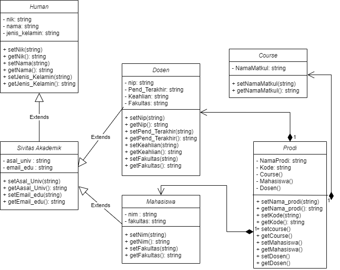
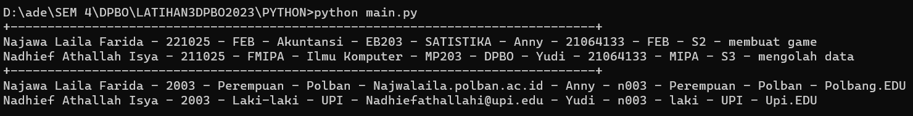
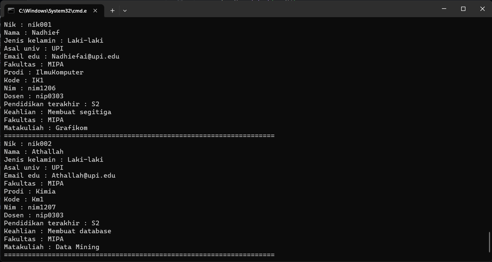

## Janji
Saya Nadhief Athallah Isya NIM 2106413 mengerjakan soal Latihan 4
dalam mata kuliah Desain Pemrograman Berorientasi Objek untuk keberkahanNya
maka saya tidak melakukan kecurangan seperti yang telah dispesifikasikan.
Aamiin.

## Tugas LATIHAN4DPBO2023

## Desain Program
Desain yang syaa buat dalam program ini terdapat 6 buah kelas yaitu Human, Sivitas Akademik, Mahasiswa, Dosen, Program Studi, Course.

### => SivitasAkademik inheritance Human
mengapa inheritance karena secara objek SivitasAkademik dan Human itu sama, lalu atribut yang ada di Human semuanya bisa di gunakan di kelas SivitasAkademik.

### => Mahasiswa dan Dosen inheritance SivitasAkademik 
mengapa inheritance karena secara objek Mahasiswa dan SivitiasAkademik itu sama, lalu atribut yang ada di Human semuanya bisa di gunakan di kelas Mahasiswa. selain itu mahasiswa juga bagiaan dari sivitas akademik begitu juga dosen

### => ProgramStudi komposit Course, dosen, dan mahasiswa
artinya program Studi pasti mempunya matakuliah dosen dan mahasiswa. maka dari itu didalam kelas program studi mendeklarasi atribut bertipe objek agar program studi dapat mengakses atribut dan method yang ada di course, dosen, dan mahasiswa.

**disetiap kelas sudah lengkap dengan setter getter nya**

### => ALUR PROGRAM
mengisi data course dlu lalu doosen lalu mahasiswa baru prodi kenapa karena prodi komposit ketiga kelas tsb jadi course dosen dan mahasiswa harus terisi terlebih dahulu
## Dokumentasi Program

